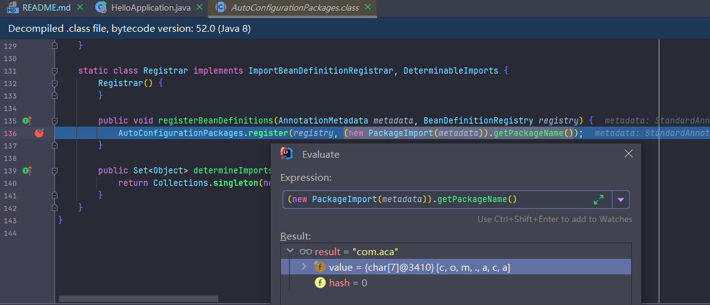
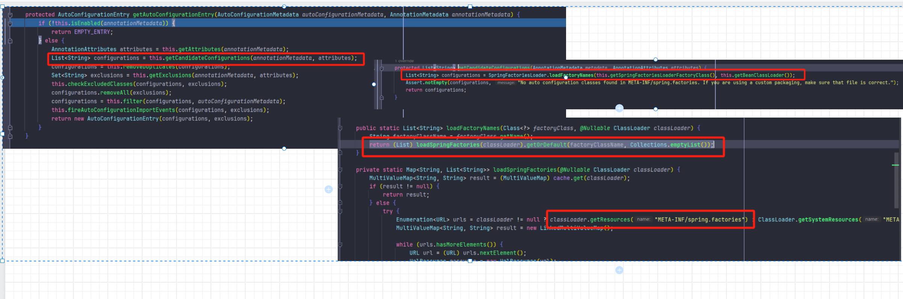
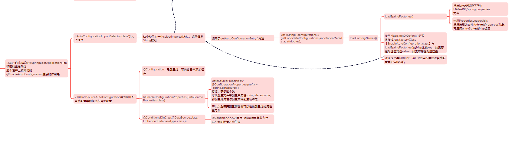

## 总结
### 启动SpringBoot一个web工程需要做的
1. 创建maven项目
2. 在pom中规定一个父工程，这个父工程是SpringBoot的web的启动依赖
3. 主启动类：加`@SpringBootApplication`注解，main方法调用`SpringApplication.run()`方法
4. 业务逻辑。。。 
5. SpringBoot在创建项目时，使用jar包打包

### 也可以用idea的Spring启动器
需要注意的是我的idea2023.3.2只能使用jdk17和21构建，且controller包的位置要写对【与启动类同包】

**因为启动类的扫包范围是它的同级目录以及其子目录**

### 对比Spring
Spring的缺点体现出来了：
1. 配置繁琐：需要写大量的xml
2. 依赖繁琐：maven需要大量的依赖，用不好还可能引发循环依赖和依赖冲突的问题

SpringBoot起步依赖：
- 在spring-boot-starter-parent中定义了各种技术的版本信息
- 在各种starter中，定义了完成该功能需要的坐标合计，其中大部分版本信息源于父工程
- 所以工程继承parent，引入starter后，通过依赖传递即可获取需要的jar包，并不会存在版本冲突等问题

### 关于@SpringBootApplication注解和自动配置
1. `@SpringBootApplication`注解
    
   标注该类是SB启动类，`@SpringBootApplication`标记了
   - `@ComponentScan`和`@ConfigurationPropertiesScan`是扫包和配置扫描 
   - `@SpringBootConfiguration`：点进去，被标记了@Configuration注解，说明这是个spring的配置类、组件
   - `@EnableAutoConfiguration`：自动导入配置

2. SB如何进行自动配置？
   
    主要是`@EnableAutoConfiguration`注解的作用，`@EnableAutoConfiguration`标记了
    - `@AutoConfigurationPackage`：自动配置包。

        该注解标记`@Import({AutoConfigurationPackages.Registrar.class})`表示导入一个Registrar类。

        这个类里有一个`registerBeanDefinition()`方法，
        该方法获得了标注该注解的类的包名。并将该包下的所有组件扫描注册到Spring容器中。
        
    - `@Import({AutoConfigurationImportSelector.class})`给容器中导入：组件选择器类
        
    
    - 总结 
   
        SpringBoot在启动的时候从类路径下的`META-INF/spring.factories`中获取EnableAutoConfiguration指定的值，将这些值作为自动配置类导入到容器中
3. 开启SpringBoot的debug=true可在控制台查看自动配置报告
#### 再总结

