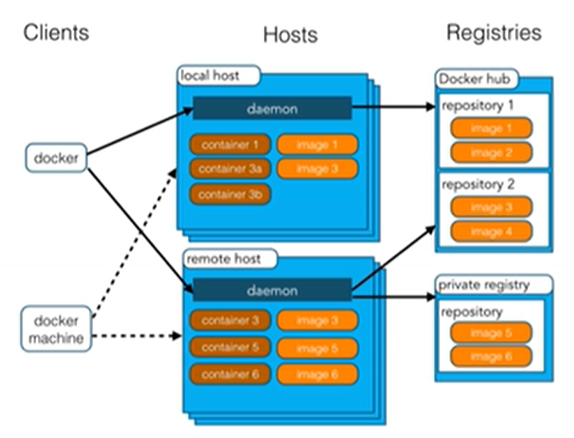

## 打包器

### 概念

1. docker主机（Host）：安装了Docker程序的机器
2. docker客户端（Client）：连接docker主机进行操作
3. docker仓库（Registry）：保存打包好的软件镜像
4. docker镜像（Images）：软件打包好的镜像，放在docker仓库中
5. docker容器（Container）：镜像启动后的实例称之为容器。容器是独立运行的一个或一组应用
6. [Docker Hub](https://hub.docker.com)网站提供了镜像
   

### 使用步骤

1. 安装Docker
2. 去docker仓库找到这个软件对应的镜像
3. 使用Docker运行这个镜像，这个镜像会生成一个Docker容器
4. 对容器的启动和停止就是对这个软件的启动和停止

### 使用Docker

我的linux操作系统为CentOS，docker要求该版本必须是3.10以上

```
cat /etc/redhat-release
CentOS Linux release 7.9.2009 (Core)

cat /proc/version
Linux version 3.10.0-1160.90.1.el7.x86_64 (mockbuild@kbuilder.bsys.centos.org) (gcc version 4.8.5 20150623 (Red Hat 4.8.5-44) (GCC) ) #1 SMP Thu May 4 15:21:22 UTC 2023
```

- 安装docker：`yum install docker`
- 启动docker：`systemctl start docker`
- 设为开机自启：`systemctl enable docker`

#### 命令

1. docker search xxx：在hub.docker.com里寻找镜像
    - name：镜像名
    - stars：以k为单位，关注的人数
    - official：是否为官方
    - automated：是否为自动配置
2. docker pull xxx：拉取镜像，使用tag指定版本，缺省为latest
3. docker images：查找所有本地镜像列
4. docker rmi [image-id]: 删除指定id的镜像
5. docker run --name [容器名] -d [镜像名]：运行并命名容器，`-d`表示后台运行
6. docker ps：查看运行中的容器。-a：查看所有的容器
7. docker start [names 或 container id]：启动容器
8. docker stop [names 或 container id]：停止运行中的容器
9. docker rm [names 或 container id]：删除容器
10. docker run -p 8888:8080 [names 或 container id]：使用端口映射【主机端口:容器端口】
11. service firewalld status：查看防火墙状态；service firewalld stop：关闭防火墙
12. docker logs [names 或 container id]：查看容器日志

查看端口号并根据PID杀死进程
```
lsof -i :<端口号>
likk -9 :<PID>
```