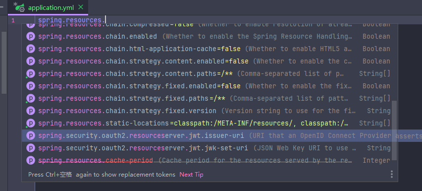

SB静态资源映射规则

## 1.引入外部静态资源

在`org.springframework.boot.autoconfigure.web.servlet.WebMvcAutoConfiguration.WebMvcAutoConfigurationAdapter`类下有方法

```java
@Override
public void addResourceHandlers(ResourceHandlerRegistry registry) {
    if (!this.resourceProperties.isAddMappings()) {
        logger.debug("Default resource handling disabled");
        return;
    }
    Duration cachePeriod = this.resourceProperties.getCache().getPeriod();
    CacheControl cacheControl = this.resourceProperties.getCache().getCachecontrol().toHttpCacheControl();
    if (!registry.hasMappingForPattern("/webjars/**")) {
        
        // 所有匹配/webjars/**的请求，都去classpath:/META-INF/resources/webjars/下寻找
        
        customizeResourceHandlerRegistration(registry.addResourceHandler("/webjars/**")
                .addResourceLocations("classpath:/META-INF/resources/webjars/")
                .setCachePeriod(getSeconds(cachePeriod)).setCacheControl(cacheControl));
    }
    String staticPathPattern = this.mvcProperties.getStaticPathPattern();
    if (!registry.hasMappingForPattern(staticPathPattern)) {
        customizeResourceHandlerRegistration(registry.addResourceHandler(staticPathPattern)
                .addResourceLocations(getResourceLocations(this.resourceProperties.getStaticLocations()))
                .setCachePeriod(getSeconds(cachePeriod)).setCacheControl(cacheControl));
    }
}
```

这个方法的作用与`<mvc:resources mapping="/webjars/**" location="classpath:/META-INF/resources/webjars/" />`相同


webjars即以jar包方式引入资源
```xml
<!--引入jquery的webjar-->
<dependency>
    <groupId>org.webjars</groupId>
    <artifactId>jquery</artifactId>
    <version>3.7.1</version>
</dependency>
```


也就是说如果想要访问jquery.js资源，只需访问`/webjars/jquery/3.7.1/jquery.js`即可


## 2.引入自定义的静态资源

在上面的addResourceHandlers()方法里
```
String staticPathPattern = this.mvcProperties.getStaticPathPattern();
if (!registry.hasMappingForPattern(staticPathPattern)) {
    customizeResourceHandlerRegistration(registry.addResourceHandler(staticPathPattern)
            .addResourceLocations(getResourceLocations(this.resourceProperties.getStaticLocations()))
            .setCachePeriod(getSeconds(cachePeriod)).setCacheControl(cacheControl));
}
```

这个staticPathPattern为静态字符串`/**`，目的是检查是否已有映射存在。如果不存在，则添加一个ResourceHandler。

添加了啥映射？在`org.springframework.boot.autoconfigure.web.ResourceProperties`已经定义。这个类是设置静态资源相关的配置类。

**这么一大串的意思是：访问当前项目的任何资源`/**`，如果没有找到映射处理器，就从resourceProperties.getStaticLocations()这个值里寻找。**

这个值在`ResourceProperties`配置类里定义为静态常量字符串数组

```
private static final String[] CLASSPATH_RESOURCE_LOCATIONS = { 
    "classpath:/META-INF/resources/",
    "classpath:/resources/", 
    "classpath:/static/", 
    "classpath:/public/" 
};
```


也就是说，静态资源保存到以上四个文件夹下即可【还有`/`】。要想访问这四个文件夹下的静态资源，只需请求文件名。

试了一下，相同文件名的访问在`CLASSPATH_RESOURCE_LOCATIONS`的数组越往后的文件夹，优先级越低。


## 3.首页映射

```java
@Bean
public WelcomePageHandlerMapping welcomePageHandlerMapping(ApplicationContext applicationContext) {
    WelcomePageHandlerMapping welcomePageHandlerMapping = new WelcomePageHandlerMapping(new TemplateAvailabilityProviders(applicationContext), applicationContext, getWelcomePage(),this.mvcProperties.getStaticPathPattern());
    welcomePageHandlerMapping.setInterceptors(getInterceptors());
return welcomePageHandlerMapping;

private Optional<Resource> getWelcomePage() {
String[] locations = getResourceLocations(this.resourceProperties.getStaticLocations());
return Arrays.stream(locations).map(this::getIndexHtml).filter(this::isReadable).findFirst();
}

private Resource getIndexHtml(String location) {
    return this.resourceLoader.getResource(location + "index.html");
}
```

在这里可以看到，寻找首页就是寻找四个静态文件夹下的index.html页面


## 4.图标

```java
@Configuration
@ConditionalOnProperty(value = "spring.mvc.favicon.enabled", matchIfMissing = true)
public static class FaviconConfiguration implements ResourceLoaderAware {
    @Bean
    public SimpleUrlHandlerMapping faviconHandlerMapping() {
        SimpleUrlHandlerMapping mapping = new SimpleUrlHandlerMapping();
        mapping.setOrder(Ordered.HIGHEST_PRECEDENCE + 1);
        mapping.setUrlMap(Collections.singletonMap("**/favicon.ico", faviconRequestHandler()));
        return mapping;
    }
    @Bean
    public ResourceHttpRequestHandler faviconRequestHandler() {
        ResourceHttpRequestHandler requestHandler = new ResourceHttpRequestHandler();
        requestHandler.setLocations(resolveFaviconLocations());
        return requestHandler;
    }
    private List<Resource> resolveFaviconLocations() {
        String[] staticLocations = getResourceLocations(this.resourceProperties.getStaticLocations());
        List<Resource> locations = new ArrayList<>(staticLocations.length + 1);
        Arrays.stream(staticLocations).map(this.resourceLoader::getResource).forEach(locations::add);
        locations.add(new ClassPathResource("/"));
        return Collections.unmodifiableList(locations);
    }
}
```

这个配置类的作用是把请求`**/favicon.ico`也映射到四个静态资源文件夹下。


## 5.自定义ResourceProperties
学习了自动配置，可以依照ResourceProperties类的属性来改变某些配置

