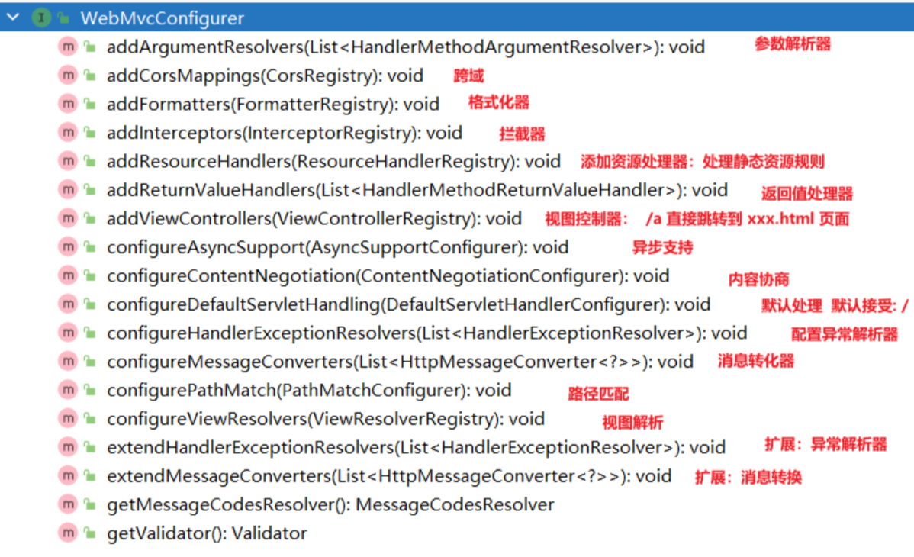

## 1.自动配置

1、整合web场景

```xml

<dependency>
    <groupId>org.springframework.boot</groupId>
    <artifactId>spring-boot-starter-web</artifactId>
</dependency>
```

2、引入了 `autoconfigure`功能

3、`@EnableAutoConfiguration`注解使用`@Import(AutoConfigurationImportSelector.class)`批量导入组件

4、加载 `META-INF/spring/org.springframework.boot.autoconfigure.AutoConfiguration.imports` 文件中配置的所有组件

5、通过`@EnableConfigurationProperties`导入xxxProperties类，这些Properties类绑定了配置文件的一堆配置项

## 2.WebMvcAutoConfiguration原理

1、生效条件

```java

@AutoConfiguration(after = {DispatcherServletAutoConfiguration.class, TaskExecutionAutoConfiguration.class,
        ValidationAutoConfiguration.class}) //在以下自动配置完之后再进行的配置
@ConditionalOnWebApplication(type = Type.SERVLET) //如果是web应用就生效，类型SERVLET、REACTIVE 响应式web
@ConditionalOnClass({Servlet.class, DispatcherServlet.class, WebMvcConfigurer.class}) //导入了类才生效
@ConditionalOnMissingBean(WebMvcConfigurationSupport.class) //容器中没有这个Bean，才生效。默认就是没有
@AutoConfigureOrder(Ordered.HIGHEST_PRECEDENCE + 10)//优先级
@ImportRuntimeHints(WebResourcesRuntimeHints.class)
public class WebMvcAutoConfiguration {
}
```

2、效果
1. 放了两个Filter：
    1. `HiddenHttpMethodFilter`；页面表单提交Rest请求（GET、POST、PUT、DELETE）
    2. `FormContentFilter`： 表单内容Filter，GET（数据放URL后面）、POST（数据放请求体）请求可以携带数据。因为在HTTP规范里PUT、DELETE的请求体数据会被忽略
   ```java
   @Bean
   @ConditionalOnMissingBean(HiddenHttpMethodFilter.class)
   @ConditionalOnProperty(prefix = "spring.mvc.hiddenmethod.filter", name = "enabled")
   public OrderedHiddenHttpMethodFilter hiddenHttpMethodFilter() {
     return new OrderedHiddenHttpMethodFilter();
   }
   
   @Bean
   @ConditionalOnMissingBean(FormContentFilter.class)
   @ConditionalOnProperty(prefix = "spring.mvc.formcontent.filter", name = "enabled", matchIfMissing = true)
   public OrderedFormContentFilter formContentFilter() {
     return new OrderedFormContentFilter();
   }
   ```
2. 给容器中放了`WebMvcConfigurer`组件；给SpringMVC添加各种定制功能
    1. 所有的功能最终会和配置文件进行绑定【@EnableConfigurationProperties】
    2. WebMvcProperties： `spring.mvc`配置文件
    3. WebProperties： `spring.web`配置文件

   ```java
   
   @Configuration(proxyBeanMethods = false)
   @Import(EnableWebMvcConfiguration.class) //额外导入了其他配置
   @EnableConfigurationProperties({WebMvcProperties.class, WebProperties.class})
   @Order(0)
   public static class WebMvcAutoConfigurationAdapter implements WebMvcConfigurer, ServletContextAware {
   
   }
   ```
3. WebMvcConfigurer接口

   提供了配置SpringMVC底层的所有组件入口

   